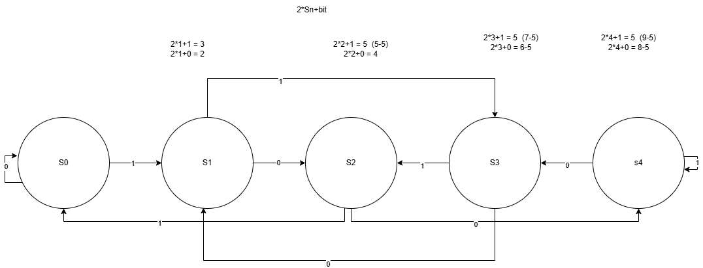

# Finite State Machine Modulo Solver
This project uses a finite state machine (FSM) to produce results for binary numbers (represented as strings) modulo.

## Concept of the Solution



The concept behind using finite state machines to solve modulo for sunsigned binary strings relies of the following ideas:

- Each node in a state machine refers to the remainder that would be reached as the binary string is read single bit at a time
- As these are binary bits (1/0), at any given Node, there can only be two possible connections to other nodes.
- The movement from one node to either of the other two nodes, its dependant on the following formula: `(2n+b) % m` where n is current states representing remainder, b is either bit (0 or 1) and m is the modulo. (note the `%m` here is used to handle overflow, allowing a wrap for the nodes interactions)
- Once these interactions are set, the action loop runs through the established state machine, till there are no more bits in the binary string left. The final state left, the remainder representing that state, would be our answer.

Example of a this for modulo 5 is already shown in the diagram above.

## Folder Structure
The project is structured as follows:

```text
project-root/
├── images/
│   └── fsm.png
├── src/
│   ├── app.py
│   ├── lib/
│   │   ├── finite_state_machine.py
│   │   └── node.py
│   └── tests/
│       ├── test_modulo_solver.py
│       └── test_state_machine.py
├── README.md
```

Note:

* `images/` contains visual assets used in `README.md`.
* `src/lib/` holds all the classes as logic modules such as `finite_state_machine.py`, `node.py`.
* `src/tests/` contains test files.
* `src/app.py` The application runner that uses the logic modules to provide results.
* `README.md` is at the root.


## How to run
- To run normal mode:
`python src/__main__.py -i ""110"" -m 3`

Here i will be the `input`, m will be the `modulo`.

- To run debug mode: 
`python src/__main__.py -i ""110"" -m 3 -d`

Here `-d` is used to activate debug mode. This will log the flow of the finite state machine

- To run unittests: 
`pytest src/test`

Make sure if you don't have pytest you run `pip install pytest`
> Note all runs are made on root folder
## Unit tests

All unit tests exist in the `src/tests`. 

To add new tests for checking logic for setting up interactions and the finite state machine, make changes in `test_state_machine.py`

To add new tests to check the simulation and the logic of the simulation, make changes to `app.py`

